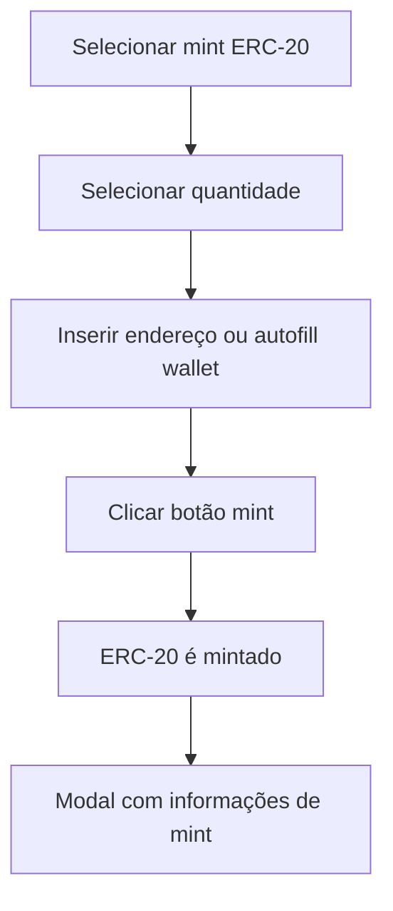
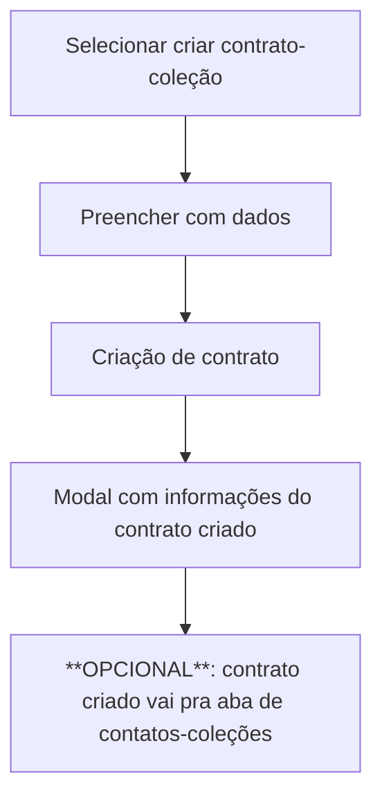
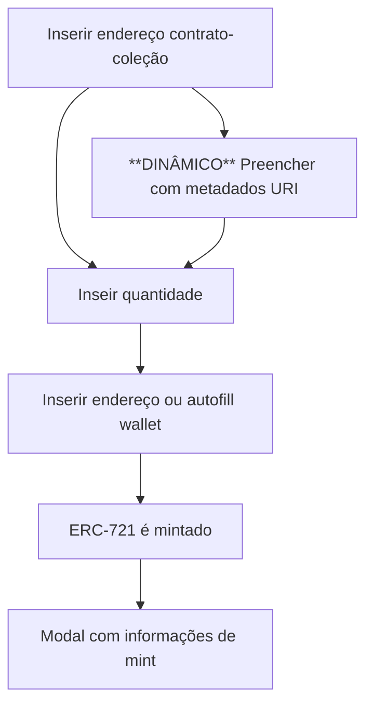

# Teste 1: Emissão de Tokens

## 1. Visão & Objetivo

**Objetivo:** Criar uma página que permita mint de tokens ERC-20 e ERC-721.

**Lição:** Como lidar com tokens ERC-20 e ERC-721 da forma mais básica possível.

---

## 2. Requisitos Funcionais (RF)

| Código    | Descrição                                                    | Critério de Aceite                                 |
| --------- | ------------------------------------------------------------ | -------------------------------------------------- |
| **RF-01** | Ser possível mintar para endereço X um token ERC-20          | O token deve ser mintado e enviado para o endereço |
| **RF-02** | Ser possível criar um contrato ERC-721                       | O contrato-coleção deve ser criado                 |
| **RF-03** | Ser possível mintar para endereço X um token ERC-721 do contrato-coleção | O token deve ser mintado e enviado para o endereço |
| **RF-04** | O sistema deve já ter internamente as ABIs de dos contratos pra poder interagir com eles | Pode interagir com o contrato                      |

---

## 3. Requisitos Não-Funcionais (RNF)

1. **Observavilidade 1:** Eventos detalhados de todos os acontecimentos no contrato.
2. **Observavilidade 2:** Log de todas as transações e eventos.
3. **Real-World Simulation:** Deploy em uma testnet pública.

---

## 4. Regras de Negócio (RN)

| Código          | Regra                                                        | Ação/Sistema                                                 |
| --------------- | ------------------------------------------------------------ | ------------------------------------------------------------ |
| **RN-01**       | Usuário deve poder conectar na aplicação com sua wallet      | Wallet conectada                                             |
| **RN-02**       | Ao conectar, a lib de conexão da wallet deve trocar automaticamente ou pedir a troca para a rede de testes sendo utilizada | Troca para a rede de testes                                  |
| **RN-03**       | Para mintar ERCs-20, o usuário deve poder selecionar a quantidade de tokens mintáveis | Determina de tokens a serem recebidos                        |
| **RN-04**       | Para mintar ERCs-20, o usuário deve poder inserir manualmente a carteira e que vai receber a quantidade de tokens | Recebe a quantidade correta no endereço                      |
| **RN-05**       | Deve poder haver opção de auto-fill de endereço baseado na carteira conectada para ERC-20 e ERC-721 | Sistema via conexão de wallet dá opção de colocar o endereço da wallet conectada no campo de endereço |
| **RN-06**       | Ao enviar o ERC-721, deve abrir um modal dizendo que quantidade X foi enviada para wallet Y | Sistema mostra dados do mint                                 |
| **RN-07**       | Para criar uma coleção ERC-721, o usuário deve inserir: **nome**, **símbolo**, **URI padrão** (caso não seja dinâmico) | Minta e envia a quantidade                                   |
| **RN-08**       | O contrato pode ser **padrão** ou **dinâmico**. **Dinâmicos** possuem tokens URIs únicas pra cada token. **Padrão** possuem a mesma URI para cada token | Configuração do contrato                                     |
| **RN-09**       | Quando o contrato for criado, deve-se exibir um modal que o contrato foi criado e o endereço do contrato | Transparência                                                |
| **RN-10**       | Para mintar um ERC-721, deve-se inserir o endereço do contrato criado via o factory | Identificar o contrato para criação                          |
| **RN-11**       | Para mintar um ERC-721, deve-se inserir a quantidade de tokens que serão mintados | Determina de tokens a serem recebidos                        |
| **RN-12**       | Para mintar um ERC-721, deve-se inserir o endereço que irá receber o mintado | Endereço de recebimento                                      |
| **RN-13**       | Para mintar um ERC-721 **DINÂMICO**, deve-se inserir a URI dos metadados | Conteúdo do token                                            |
| **RN-14**       | Ao ser mintado o ERC-721, deve-se abrir um modal mostrando a imagem, quantos foram mintados e para qual endereço | Sistema mostra dados do mint                                 |
| **RN-OPCIONAL** | Armazenamento em uma aba dos contratos-coleções criados      | Fácil acesso aos endereços                                   |

---

## 5. Fluxo Geral ERC-20

## 6. Fluxo Criação Coleção

## 7. Fluxo Criação ERC-721

